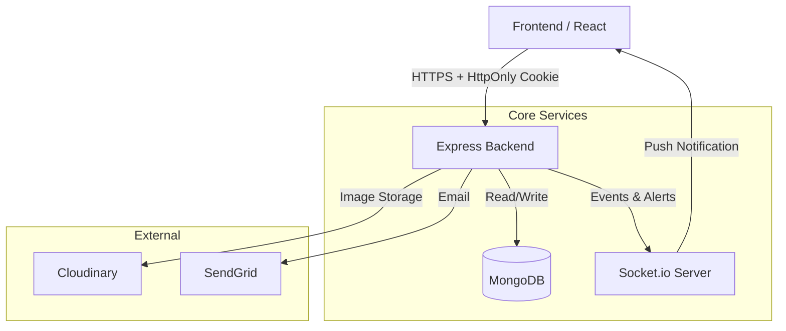

# 🛡️ ApnaManager Backend

> A Hotel Management & Security Verification System facilitating seamless, secure data exchange between Hotels and Law Enforcement Agencies.

[](https://nodejs.org/)
[](https://expressjs.com/)
[](https://www.mongodb.com/)
[](https://socket.io/)
[](https://github.com/features/actions)

---

## 📖 Table of Contents

- [System Overview](#-system-overview)
- [Tech Stack](#-tech-stack)
- [Key Features](#-key-features)
- [System Architecture](#-system-architecture)
- [Installation & Setup](#-installation--setup)
- [Project Structure](#-project-structure)

---

## 🔍 System Overview

ApnaManager is a robust backend solution designed to digitize hotel guest entries and automate police verification processes. It eliminates manual paperwork by providing a secure, real-time digital pipeline.

**Core Roles:**
1.  **Hotel Managers:** Fast guest check-in, real-time room management, and automated checkout.
2.  **Police/Authorities:** Instant notifications for suspicious guests, powerful search engine, and history tracking.
3.  **Admin:** System-wide oversight, user management, and audit logs.

---

## 🛠 Tech Stack

| Category | Technologies |
|----------|--------------|
| **Runtime** | Node.js (v18+) |
| **Framework** | Express.js |
| **Database** | MongoDB (Mongoose ORM) |
| **Real-Time** | Socket.io (Instant Alerts) |
| **Authentication** | JWT via HttpOnly Cookies (XSS Protection) |
| **File Storage** | Cloudinary (Secure Image Storage) |
| **Testing** | Jest & Supertest |
| **DevOps** | GitHub Actions (CI/CD), Docker |

---

## 🚀 Key Features

### 🔐 Enterprise Security
* **Role-Based Access Control (RBAC):** Strict permission layering for Hotel, Police, and Admin users.
* **Secure Authentication:** JWT tokens stored in HttpOnly cookies to prevent XSS attacks.
* **Audit Logs:** Tracks every critical action (Search, Alert, Checkout) for accountability.

### ⚡ Performance & Optimization
* **MongoDB Text Indexing:** High-speed fuzzy search for Guest Names and Phone numbers (handles 10k+ records easily).
* **Real-Time Alerts:** Uses **Socket.io** to instantly notify Police dashboards when a flagged guest checks in. No page refresh required.
* **Optimized Queries:** Uses `lean()` queries and selective population to reduce server load.

### 🏭 DevOps & Quality
* **CI/CD Pipeline:** Automated GitHub Actions workflow that runs Linting and Tests (`npm test`) on every push.
* **Code Standards:** Enforced using ESLint, Prettier, and Husky hooks to prevent bad commits.
* **Robust Error Handling:** Centralized error middleware with standardized API responses.

---

## 🏗 System Architecture

The system follows a scalable **MVC Architecture** with Event-Driven components.



---

## 📚 API Documentation

We use **Postman** for standardizing our API requests.

We have made a Collection of the APIs which is present in the application backend so to get those please inbox me then i will share you the postman collection link.

> **Note:** To test protected routes, please login via the `/auth/login` endpoint first. The system will automatically set the `jwt` cookie for subsequent requests.

---

## ⚙️ Installation & Setup

### Prerequisites

- Node.js (v18+)
- Docker & Docker Compose (Optional)
- Redis Server (Running locally or in cloud)

### 1. Clone the Repository

```bash
git clone [https://github.com/your-username/apnamanager-backend.git](https://github.com/your-username/apnamanager-backend.git)
cd apnamanager-backend

```

### 2. Environment Variables

Create a `.env` file in the root directory:

```env
PORT=5000
MONGO_URI=your_mongodb_connection_string
JWT_SECRET=your_super_secret_key
REDIS_URL=redis://localhost:6379  # Or your cloud Redis URL
CLOUDINARY_CLOUD_NAME=your_name
CLOUDINARY_API_KEY=your_key
CLOUDINARY_API_SECRET=your_secret
SENDGRID_API_KEY=your_sendgrid_key

```

### 3. Run with Docker (Recommended)

```bash
docker-compose up --build

```

### 4. Run Manually

```bash
# Install Dependencies
npm install

# Run in Development Mode
npm run dev

```

## 📂 Project Structure

```
src/
├── config/         # Database & Redis configuration
├── controllers/    # Business logic (Guest, Auth, Uploads)
├── middleware/     # Auth (Cookie check), Error Handling, Multer
├── models/         # Mongoose Schemas
├── routes/         # API Route definitions
├── utils/          # Helpers (Cloudinary Stream, PDF Gen)
└── server.js       # Application Entry Point

```

## 🤝 Contributing

We follow Clean Code principles enforced by CI/CD.

Run Tests: Ensure npm test passes before pushing.

Linting: Fix any ESLint errors.

Commits: Use conventional messages (e.g., feat: add guest search).

### Steps

1. Fork the Project.
2. Create your Feature Branch (`git checkout -b feature/NewFeature`).
3. Commit your Changes (`git commit -m 'feat: Add NewFeature'`).
4. Push to the Branch (`git push origin feature/NewFeature`).
5. Open a Pull Request.

---

Made with ❤️ by [Uttkarsh](https://www.google.com/search?q=https://github.com/uttkarshnjr10)
