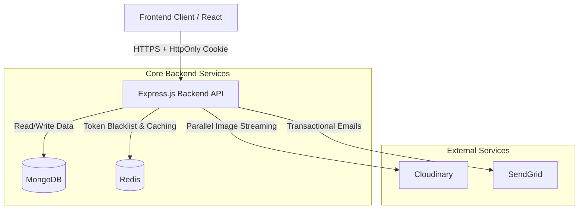

# 🛡️ ApnaManager Backend

> An enterprise-grade Hotel Management & Security Verification System facilitating seamless, secure data exchange between Hotels and Law Enforcement Agencies.

[](https://nodejs.org/)
[](https://expressjs.com/)
[](https://www.mongodb.com/)
[](https://redis.io/)
[](https://www.docker.com/)

---

## 📖 Table of Contents
- [System Overview](#-system-overview)
- [Tech Stack & Architecture](#-tech-stack--architecture)
- [Key Features](#-key-features)
- [API Documentation](#-api-documentation)
- [Installation & Setup](#-installation--setup)
- [Project Structure](#-project-structure)
- [Contributing](#-contributing)

---

## 🔍 System Overview

GuestGuard is a robust backend solution designed to digitize hotel guest entries and automate police verification processes. It eliminates manual paperwork by providing a secure digital pipeline.

**Core Roles:**
1.  **Hotel Managers:** Fast guest check-in with image handling, report generation, and room management.
2.  **Police/Authorities:** Real-time dashboard to monitor guest entries, manage watchlists, and receive alerts.
3.  **Admin:** System-wide oversight and user management.

---

## 🛠 Tech Stack & Architecture

The system is built on a **Monolithic Architecture**, optimized for speed and data integrity.

| Category | Technologies |
|----------|--------------|
| **Runtime** | Node.js (v18+) |
| **Framework** | Express.js |
| **Database** | MongoDB (Mongoose ORM) |
| **Caching** | Redis (JWT Blacklisting & Session Security) |
| **Authentication** | JWT via HttpOnly Cookies (XSS Protection) |
| **File Storage** | Cloudinary (High-performance Parallel Streaming) |
| **Email Service** | SendGrid |
| **DevOps** | Docker, Docker Compose |

### 🏗 System Architecture
This diagram illustrates the actual data flow in the deployed environment:



---

## 🚀 Key Features

### 🔐 Enterprise Security

* **HttpOnly Cookie Authentication:** Tokens are handled by the browser/server, preventing XSS attacks (no local storage).
* **Redis-Based Logout:** Immediate token invalidation using a Redis blacklist.
* **Role-Based Access Control (RBAC):** Strict permission layering for Hotel, Police, and Admin users.

### ⚡ High Performance

* **Parallel Upload Pipeline:** Guest registration images (ID Front, Back, Live Photo) are streamed to Cloudinary simultaneously using `Promise.all` and memory buffering, significantly reducing wait times.
* **Optimized Database Queries:** Indexed fields for fast search and report generation.

### 🏨 Core Logic

* **Real-Time Watchlist:** Automatically checks guest ID numbers against a police watchlist and triggers alerts.
* **Automated Reporting:** Generates downloadable PDF/CSV reports for daily police submission.
* **Room Management:** Real-time occupancy tracking.

---

## 📚 API Documentation

We use **Postman** for standardizing our API requests.

### 🚀 Run in Postman

Click the button below to import the full API collection. This includes pre-configured environments and request examples.

[](https://www.google.com/search?q=https://uttkarshkumar.postman.co/workspace/My-Workspace~f34e0db9-e0c4-4342-8779-b96c300991d6/collection/43592077-22d12ca9-d5c4-4882-9529-0b09f5303210?action=share&creator=43592077&active-environment=43592077-e1da4c0a-a370-47b0-af49-dd61bb95b8bd)

> **Note:** To test protected routes, please login via the `/auth/login` endpoint first. The system will automatically set the `jwt` cookie for subsequent requests.

---

## ⚙️ Installation & Setup

### Prerequisites

* Node.js (v18+)
* Docker & Docker Compose (Optional)
* Redis Server (Running locally or in cloud)

### 1. Clone the Repository

```bash
git clone [https://github.com/your-username/apnamanager-backend.git](https://github.com/your-username/apnamanager-backend.git)
cd apnamanager-backend

```

### 2. Environment Variables

Create a `.env` file in the root directory:

```env
PORT=5000
MONGO_URI=your_mongodb_connection_string
JWT_SECRET=your_super_secret_key
REDIS_URL=redis://localhost:6379  # Or your cloud Redis URL
CLOUDINARY_CLOUD_NAME=your_name
CLOUDINARY_API_KEY=your_key
CLOUDINARY_API_SECRET=your_secret
SENDGRID_API_KEY=your_sendgrid_key

```

### 3. Run with Docker (Recommended)

```bash
docker-compose up --build

```

### 4. Run Manually

```bash
# Install Dependencies
npm install

# Run in Development Mode
npm run dev

```


## 📂 Project Structure

```
src/
├── config/         # Database & Redis configuration
├── controllers/    # Business logic (Guest, Auth, Uploads)
├── middleware/     # Auth (Cookie check), Error Handling, Multer
├── models/         # Mongoose Schemas
├── routes/         # API Route definitions
├── utils/          # Helpers (Cloudinary Stream, PDF Gen)
└── server.js       # Application Entry Point

```


## 🤝 Contributing

Contributions are welcome! We follow strict **Clean Code** principles.

### Guidelines for Contributors

1. **Architecture:** Keep controllers thin; move complex logic to services or models where possible.
2. **Error Handling:** Do not use `try-catch` blocks manually in controllers. Use the `asyncHandler` wrapper and `ApiError` class.
3. **Variable Naming:** Use descriptive, camelCase names (e.g., `guestRegistrationDate` instead of `d`).
4. **Commits:** Use conventional commit messages.

### Steps

1. Fork the Project.
2. Create your Feature Branch (`git checkout -b feature/NewFeature`).
3. Commit your Changes (`git commit -m 'feat: Add NewFeature'`).
4. Push to the Branch (`git push origin feature/NewFeature`).
5. Open a Pull Request.

---

Made with ❤️ by [Uttkarsh](https://www.google.com/search?q=https://github.com/uttkarshnjr10)

