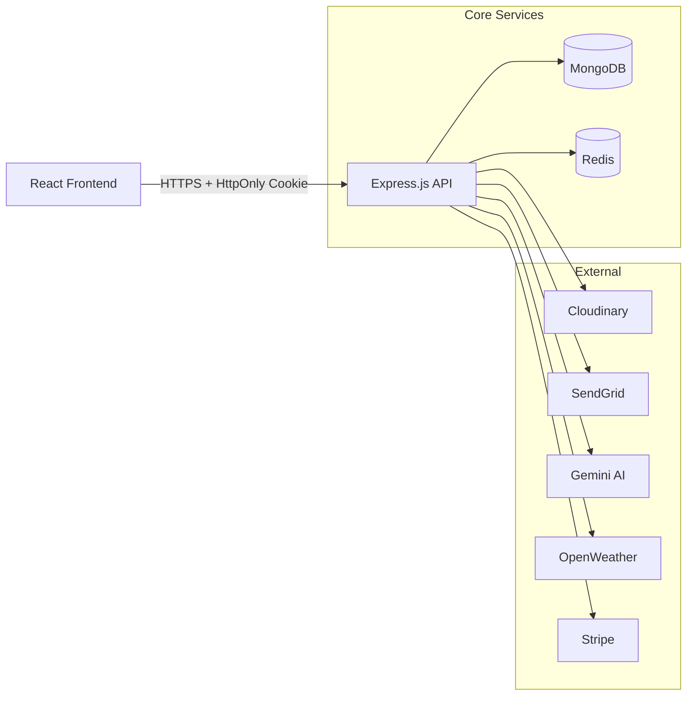

# ApnaManager Backend

> Enterprise-grade Hotel Management & Security Verification API — facilitating secure, real-time data exchange between Hotels and Law Enforcement.

[](https://nodejs.org/)
[](https://expressjs.com/)
[](https://www.mongodb.com/)
[](https://redis.io/)
[](https://www.docker.com/)
[](https://jestjs.io/)

---

## Table of Contents

- [Overview](#overview)
- [Architecture](#architecture)
- [Tech Stack](#tech-stack)
- [Key Features](#key-features)
- [Project Structure](#project-structure)
- [Getting Started](#getting-started)
- [Environment Variables](#environment-variables)
- [Docker Deployment](#docker-deployment)
- [Testing](#testing)
- [API Reference](#api-reference)
- [Contributing](#contributing)

---

## Overview

ApnaManager digitizes hotel guest registration and automates police verification workflows. It replaces manual paperwork with a secure digital pipeline, enabling:

- **Hotel Managers** — Guest check-in with image capture, room management, and report generation.
- **Police/Authorities** — Real-time dashboard for monitoring guest entries, watchlists, and alerts.
- **Regional Admins** — System-wide oversight, user management, AI daily summaries.

---

## Architecture


```mermaid
graph LR
    Client[React Frontend] -->|HTTPS + HttpOnly Cookie| API[Express.js API]

    subgraph Core Services
        API --> DB[(MongoDB)]
        API --> Cache[(Redis)]
    end

    subgraph External
        API --> CDN[Cloudinary]
        API --> Email[SendGrid]
        API --> AI[Gemini AI]
        API --> Weather[OpenWeather]
        API --> Payments[Stripe]
    end
```

### Layered Design

| Layer           | Responsibility                                             |
| --------------- | ---------------------------------------------------------- |
| **Routes**      | HTTP method + path mapping, middleware chaining            |
| **Controllers** | Request/response handling, input validation                |
| **Models**      | Mongoose schemas, data validation, pre-save hooks          |
| **Middleware**  | Auth (JWT + Redis blacklist), error handling, file uploads |
| **Utils**       | Cloudinary, email, PDF/CSV generation, AI service          |
| **Config**      | Database, Redis, and Socket.io initialization              |

---

## Tech Stack

| Category     | Technology                                  |
| ------------ | ------------------------------------------- |
| Runtime      | Node.js 20+                                 |
| Framework    | Express.js 4.x                              |
| Database     | MongoDB (Mongoose ODM)                      |
| Caching      | Redis (JWT blacklisting & session security) |
| Auth         | JWT via HttpOnly cookies (XSS-safe)         |
| File Storage | Cloudinary (parallel streaming uploads)     |
| Email        | SendGrid (transactional emails)             |
| AI           | Google Gemini (daily report summaries)      |
| Payments     | Stripe (subscription billing)               |
| Real-time    | Socket.io (police alert notifications)      |
| PDF          | PDFKit (checkout receipts)                  |
| DevOps       | Docker, Docker Compose, GitHub Actions CI   |

---

## Key Features

### Security

- **HttpOnly Cookie Auth** — Tokens handled server-side, preventing XSS attacks
- **Redis Token Blacklisting** — Immediate logout via token invalidation
- **RBAC** — Strict role-based access (Hotel, Police, Regional Admin)
- **Signed URLs** — Cloudinary images served via time-limited signed URLs

### Performance

- **Parallel Image Uploads** — All guest images streamed to Cloudinary concurrently
- **Database Indexing** — Compound indexes on frequently queried fields
- **In-memory Caching** — Weather data and AI reports cached to reduce API calls

### Core Workflow

- **Real-time Watchlist Matching** — Automatic ID number checks against police watchlist
- **Automated PDF Receipts** — Professional checkout PDFs emailed to guests and hotels
- **CSV Report Generation** — Date-range guest reports for police compliance

---

## Project Structure

```
server/
├── server.js                       # Entry point — HTTP server bootstrap
├── src/
│   ├── app.js                      # Express app setup, middleware, route mounting
│   ├── config/
│   │   ├── db.js                   # MongoDB connection
│   │   ├── redis.js                # Redis client & connection
│   │   └── socket.js               # Socket.io initialization
│   ├── controllers/                # Request handlers (thin — delegate to models)
│   │   ├── auth.controller.js
│   │   ├── guest.controller.js
│   │   ├── inquiry.controller.js
│   │   ├── notification.controller.js
│   │   ├── payment.controller.js
│   │   ├── police.controller.js
│   │   ├── police-station.controller.js
│   │   ├── room.controller.js
│   │   ├── upload.controller.js
│   │   ├── user.controller.js
│   │   ├── verification.controller.js
│   │   ├── watchlist.controller.js
│   │   └── weather.controller.js
│   ├── middleware/
│   │   ├── auth.middleware.js       # JWT verification + Redis blacklist check
│   │   ├── error.middleware.js      # Global error handler (Mongoose, JWT, etc.)
│   │   └── upload.middleware.js     # Multer memory storage + file filter
│   ├── models/
│   │   ├── index.js                 # Barrel export for all models
│   │   ├── guest.model.js
│   │   ├── hotel.model.js
│   │   ├── police.model.js
│   │   ├── regional-admin.model.js
│   │   ├── police-station.model.js
│   │   ├── access-log.model.js
│   │   ├── alert.model.js
│   │   ├── case-report.model.js
│   │   ├── hotel-inquiry.model.js
│   │   ├── notification.model.js
│   │   ├── remark.model.js
│   │   ├── watchlist.model.js
│   │   └── schemas/
│   │       └── base-auth.schema.js  # Shared auth fields (password hash, reset tokens)
│   ├── routes/
│   │   ├── index.js                 # Central route aggregator
│   │   ├── auth.routes.js
│   │   ├── guest.routes.js
│   │   └── ...                      # One file per resource
│   ├── scripts/
│   │   ├── seeder.js                # Database seeding (admin user)
│   │   └── create-indexes.js        # MongoDB index creation
│   └── utils/
│       ├── api-error.js             # Custom error class with status codes
│       ├── api-response.js          # Standardized API response wrapper
│       ├── async-handler.js         # Express async error wrapper
│       ├── logger.js                # Console logger with timestamps
│       ├── cloudinary.js            # Upload + signed URL generation
│       ├── ai-service.js            # Gemini AI integration
│       ├── pdf-generator.js         # PDFKit checkout receipt builder
│       ├── report-generator.js      # CSV guest report generator
│       ├── send-email.js            # SendGrid email dispatcher
│       └── email-templates/
│           ├── checkout.template.js
│           ├── credentials.template.js
│           └── reset-password.template.js
├── tests/                           # Jest integration tests
├── Dockerfile                       # Multi-stage production build
├── docker-compose.yml               # Full stack (app + Mongo + Redis)
└── jest.config.js                   # Test configuration
```

---

## Getting Started

### Prerequisites

- **Node.js** v20 or later
- **MongoDB** (local or Atlas)
- **Redis** (local, cloud, or Docker)

### Installation

```bash
# Clone the repository
git clone https://github.com/your-username/apnamanager.git
cd apnamanager/server

# Install dependencies
npm install

# Seed the admin user
npm run seed

# Start the development server
npm run dev
```

The server starts at `http://localhost:5000`.

---

## Environment Variables

Create a `.env` file in the `server/` directory:

| Variable                | Required | Description                                            |
| ----------------------- | -------- | ------------------------------------------------------ |
| `PORT`                  | No       | Server port (default: `5000`)                          |
| `MONGO_URI`             | Yes      | MongoDB connection string                              |
| `JWT_SECRET`            | Yes      | Secret key for JWT signing                             |
| `REDIS_HOST`            | Yes      | Redis hostname                                         |
| `REDIS_PORT`            | Yes      | Redis port (default: `6379`)                           |
| `CLOUDINARY_CLOUD_NAME` | Yes      | Cloudinary cloud name                                  |
| `CLOUDINARY_API_KEY`    | Yes      | Cloudinary API key                                     |
| `CLOUDINARY_API_SECRET` | Yes      | Cloudinary API secret                                  |
| `SENDGRID_API_KEY`      | Yes      | SendGrid API key                                       |
| `FROM_EMAIL`            | Yes      | Sender email address                                   |
| `CORS_ALLOWED_ORIGINS`  | Yes      | Comma-separated allowed origins                        |
| `GEMINI_API_KEY`        | No       | Google Gemini API key for AI reports                   |
| `STRIPE_SECRET_KEY`     | No       | Stripe secret key for payments                         |
| `STRIPE_WEBHOOK_SECRET` | No       | Stripe webhook signing secret                          |
| `WEATHER_API_KEY`       | No       | OpenWeatherMap API key                                 |
| `DEFAULT_CITY`          | No       | Default city for weather (default: `Patna, Bihar, IN`) |

---

## Docker Deployment

```bash
# Build and start all services
docker compose up --build -d

# View logs
docker compose logs -f apnamanager-backend

# Stop all services
docker compose down
```

The compose file provisions:

- **App** — Node.js application on port 5000
- **MongoDB** — Database on port 27017 with persistent volume
- **Redis** — Cache on port 6379 with password auth

---

## Testing

```bash
# Run all tests
npm test

# Run tests in watch mode
npm run test:watch

# Generate coverage report
npm run test:coverage
```

Tests use **Jest** with **mongodb-memory-server** for isolated database testing. External services (Cloudinary, SendGrid, Redis) are fully mocked.

---

## API Reference

### Authentication

| Method | Endpoint                    | Access  | Description                  |
| ------ | --------------------------- | ------- | ---------------------------- |
| `POST` | `/api/auth/login`           | Public  | Login with email/password    |
| `POST` | `/api/auth/logout`          | Private | Logout + token blacklist     |
| `POST` | `/api/auth/forgot-password` | Public  | Request password reset email |
| `POST` | `/api/auth/reset-password`  | Public  | Reset password with token    |
| `POST` | `/api/auth/change-password` | Public  | Forced password change       |

### Guest Management

| Method | Endpoint                   | Access | Description               |
| ------ | -------------------------- | ------ | ------------------------- |
| `POST` | `/api/guests/register`     | Hotel  | Register new guest        |
| `GET`  | `/api/guests/all`          | Hotel  | Get all hotel guests      |
| `GET`  | `/api/guests/today`        | Hotel  | Get today's registrations |
| `PUT`  | `/api/guests/:id/checkout` | Hotel  | Checkout guest            |
| `GET`  | `/api/guests/report`       | Hotel  | CSV report (date range)   |

### Police

| Method | Endpoint                | Access | Description          |
| ------ | ----------------------- | ------ | -------------------- |
| `POST` | `/api/police/search`    | Police | Search guest records |
| `GET`  | `/api/police/dashboard` | Police | Dashboard statistics |
| `POST` | `/api/police/alerts`    | Police | Create guest alert   |
| `GET`  | `/api/police/alerts`    | Police | List all alerts      |

### Admin

| Method   | Endpoint                     | Access | Description           |
| -------- | ---------------------------- | ------ | --------------------- |
| `POST`   | `/api/users/register`        | Admin  | Create new user       |
| `GET`    | `/api/users/admin/dashboard` | Admin  | System metrics        |
| `PUT`    | `/api/users/:id/status`      | Admin  | Suspend/activate user |
| `DELETE` | `/api/users/:id`             | Admin  | Delete user           |

> For protected routes, authenticate via `POST /api/auth/login`. The system sets an `HttpOnly` cookie automatically.

---

## Contributing

We follow **Clean Code** principles:

1. **Controllers stay thin** — Business logic lives in models and service helpers.
2. **No manual try-catch** — Use `asyncHandler` wrapper and `ApiError` class.
3. **Naming** — Files use `kebab-case`, variables use `camelCase`.
4. **Commits** — Use [Conventional Commits](https://www.conventionalcommits.org/).

### Steps

1. Fork the repository
2. Create a feature branch (`git checkout -b feature/new-feature`)
3. Commit changes (`git commit -m 'feat: add new feature'`)
4. Push to branch (`git push origin feature/new-feature`)
5. Open a Pull Request

---

Made with care by [Uttkarsh](https://github.com/uttkarshnjr10)
